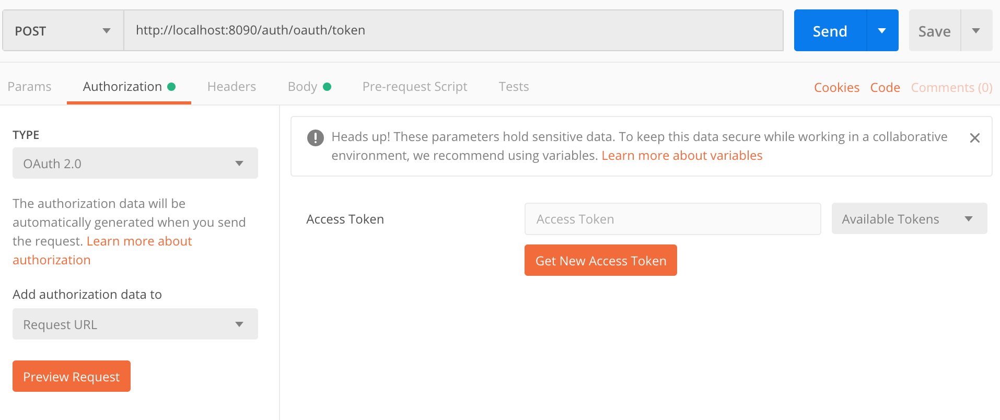
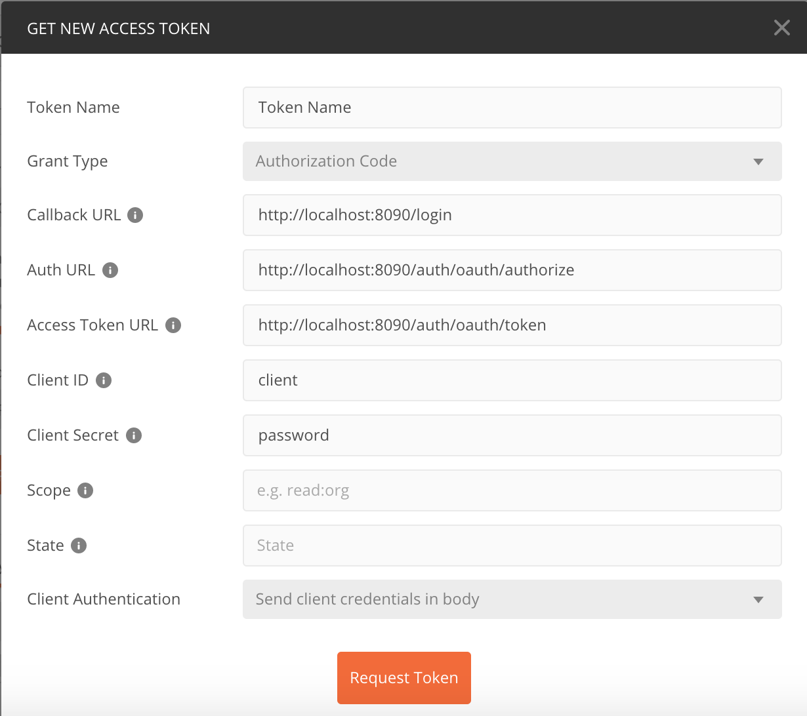
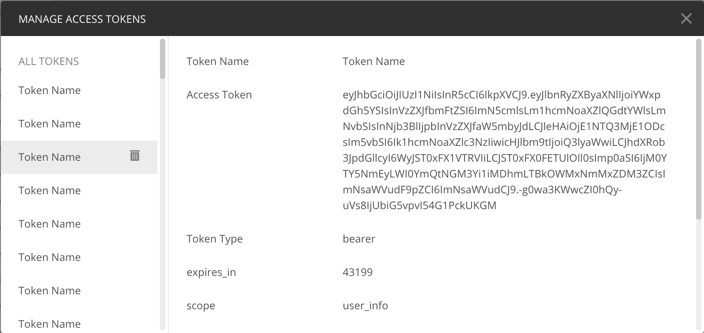

# Version

- **1.0.0-SNAPSHOT** : initialisation du projet

# Objectif

Serveur d'autorisation Oauth2 basé sur le grant _authorization_code_.

# Technique

Les services enregistrés sont les suivants :
- service d'interaction bancaire : http://localhost:8200/login
\
Lien github : https://github.com/langston8182/service-interaction

Le formulaire de login est celui par defaut de spring security. il est situé au sein du serveur d'autorisation. 
\
Port d'écoute : 8090

**Liens oauth2** :
- Récupérer le token : http://localhost:8090/auth/oauth/token
- Autorisation : http://localhost:8090/auth/oauth/authorize
- Information de l'utilisateur : http://localhost:8090/auth/user/me

**Postman** :
Se loguer pour récupérer le token JWT


\

\


# Docker

Utiliser docker-compose pour lancer le serveur.
`docker-compose up`

## Mariadb

Utiliser docker-compose dans le repertoire docker/db pour lancer le serveur mariadb.
`docker-compose up`

Pour le premier démarrage configurer la base de donnée afin d'ajouter l'utilisateur _spring_ avec le mot de passe _spring_ et tous les privileges.
```
docker exec -ti mariadb bash
mysql -u root -p
<Mot de passe root>
CREATE USER ’spring’ IDENTIFIED BY ‘spring’;
GRANT ALL PRIVILEGES ON * . * TO ‘spring’;
FLUSH PRIVILEGES;
create database bank;
use bank;
show tables;
```

# Kubernetes
L'ensemble des configurations k8s se trouvent dans le projet Gihub\
https://github.com/langston8182/kubernetes-bank

Pour lancer le service
`kubectl create -f authorization-service.yaml`

Pour lancer le deploiement
`kubectl create -f authorization-deployment.yaml`

Pour lancer le service db
`kubectl create -f db-service.yaml`

Pour lancer le deploiement db
`kubectl create -f db-deployment.yaml`

# Maven

Pour compiler le projet et créer l'image docker exécuter :
\
`mvn package`

Pour push l'image sur dockerHub, exécuter:
\
`mvn dockerfile:push`

# Configuration

Dans le fichier application.yml modifier les adresses Ip suivant si le serveur tourne en local ou dans un container. :

Ip serveur mariadb dans un container docker : 172.17.0.1
\
Ip serveur mariadb dans k8s : db-service
\
Ip service interaction dans un container : 172.22.0.1
\
Ip service interaction dans k8s : 192.168.99.100 (minikube ip)

Ajouter les ips des adresse clientes utilisant le serveur d'autorisation dans le fichier application.yml.

## Spring cloud Kubernetes

Les configuration decrites precedemment peuvent etre surchargee a chaud dans le fichier configMap de la configuration k8s.
\
Le nom de l'application définié dans la fichier _application.yaml_ doit etre le meme que le nom de la configMap dans k8s

# Contributeur

Cyril Marchive (cyril.marchive@gmail.com)
